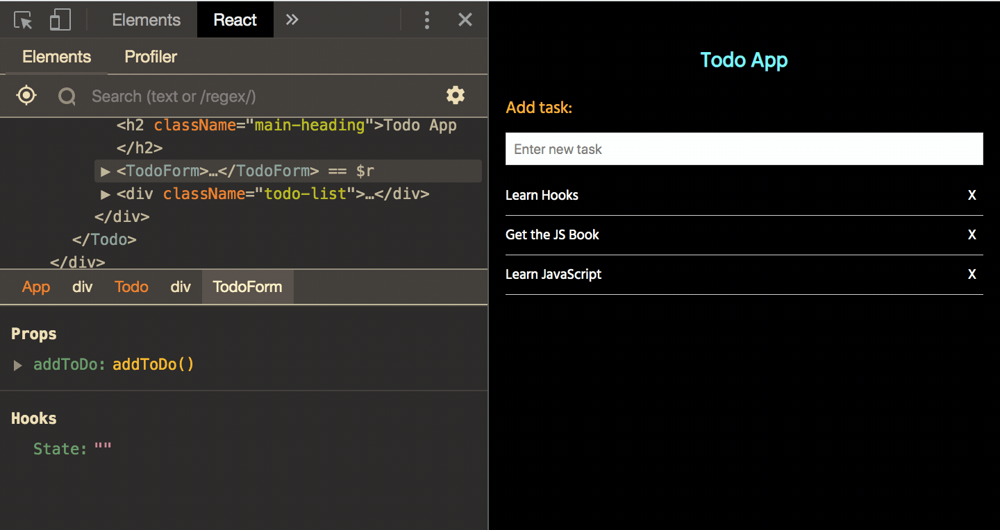

# React Hooks

:anchor: A demo app for React Hooks

## What are React Hooks?

> * A Hook is a special function that lets you “hook into” React features.
> * Hooks are a new addition in React 16.8, which allow you to use state and other React features without writing a class.
> * For example, useState is a Hook that lets you add React state to function components

## Why use React Hooks?

* They avoid the confusion of `this` keyword and bind this.
* Classes don’t minify very well, and they make hot reloading flaky and unreliable
* Allow you to reuse stateful logic, without changing your component hierarchy( or wrapping them into a HOC ).
* Complex components become hard to understand.
> * Example components might perform some data fetching in `componentDidMount` and `componentDidUpdate`, 
> * However, the same `componentDidMount` method might also contain some unrelated logic that sets up event listeners, with cleanup performed in `componentWillUnmount`

* Sometimes its difficult to break components into smaller ones because the stateful logic is all over the place, making them difficult to test.

## Features of Hooks?

* Completely opt-in
* 100% backwards-compatible
* Split one component into smaller functions based on what pieces are related (such as setting up a subscription or fetching data)
* Hooks let you use more of React’s features without classes.
* Reuse functionality between components. 

## Types of Hooks?

1. State Hook : `useState()`
   * `useState` returns a pair: the current state value and a function that lets you update it
   
   ```ruby
   const [count, setCount] = useState(0);
   ```
   
   * `useState` is similar to this.setState in a class, except it doesn’t merge the old and new state together
   
2. Effect Hook: `effectHook()`

## How do lifecycle methods correspond to Hooks?

* `constructor`: Function components don’t need a constructor. You can initialize the state in the useState call.
* `getDerivedStateFromProps`: Schedule an update while rendering instead.
* `render`: This is the function component body itself.
* `componentDidMount`, `componentDidUpdate`, `componentWillUnmount`: The useEffect Hook can express all combinations of these (including less common cases).
* `componentDidCatch` and `getDerivedStateFromError`: There are no Hook equivalents for these methods yet, but they will be added soon.


## Installation :wrench:

* Clone this repo in `git clone https://github.com/imranhsayed/react-hooks`

* `cd react-hooks`

* Run `npm install`

## Branches Information

1 [increment-counter](https://github.com/imranhsayed/react-hooks/tree/increment-counter) Simple Example for using React Hooks by incrementing counter on click of a button.
2 [todo-app](https://github.com/imranhsayed/react-hooks/tree/todo-app) Example of creating a Todo App using React Hooks

### Todo App Demo :video_camera:



## Commands :computer:

- `dev` Runs webpack dev server for development ( in watch mode )
- `prod` Runs webpack in production mode

